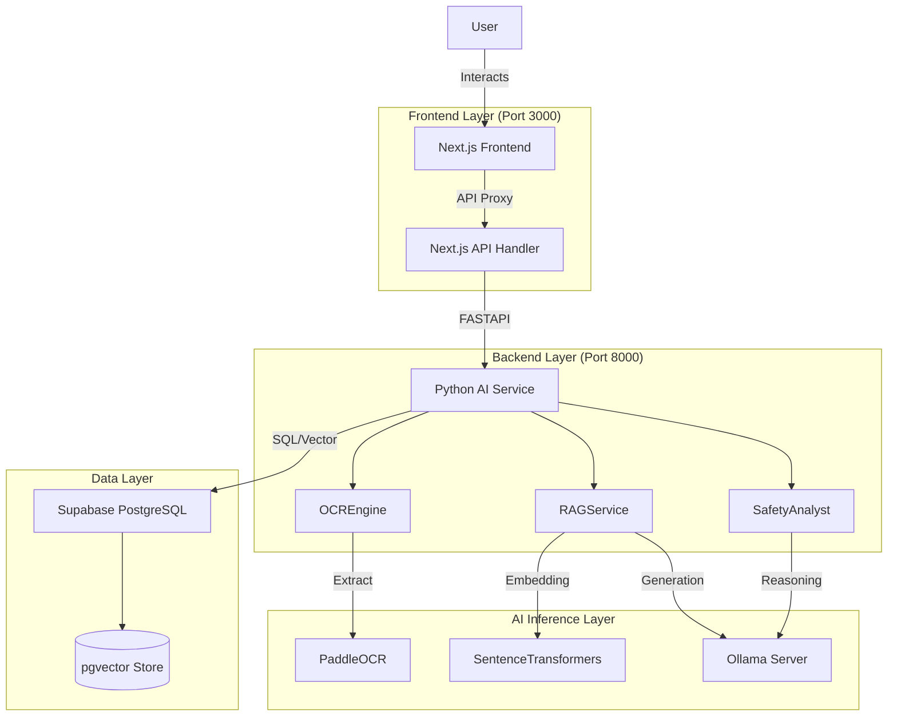

# System Architecture

## High-Level Architecture
IngreSure follows a **Hybrid AI Architecture** that combines deterministic rules (Symbolic AI) for safety with probabilistic LLMs for reasoning and interaction.

## Core Workflows

### 1. The "Gold Standard" Analysis Pipeline
Used for `/chat/grocery` and `/scan`. This pipeline prioritizes safety over creativity.

1.  **Input**: User Image or Text Query.
2.  **Extraction**: 
    - If Image: `PaddleOCR` extracts text -> `LLM` normalizes errors ("sugr" -> "sugar").
    - If Text: Direct input.
3.  **Ontology Mapping**: Ingredients are mapped to the local `ingredient_ontology.py` (O(1) lookup).
    - *Example*: "Milk" -> `{ source: "milk", allergens: ["Dairy"] }`.
4.  **Rule Execution**: The `SafetyAnalyst` checks the user's Profile against mapped properties.
    - *Logic*: `User(Vegan) + Ingredient(Milk) = NOT SAFE`.
5.  **Fallback**: If an ingredient is unknown (e.g., "E471"), the LLM is called to explain the ambiguity ("E471 can be plant or animal derived...").

### 2. The RAG Pipeline (Restaurant Search)
Used for `/chat/restaurant`. Prioritizes finding relevant information.

1.  **Query Processing**: `DietaryRuleEngine` extracts filters (e.g., "Vegan options").
2.  **Embedding**: Query is converted to a 384-dimensional vector using `all-MiniLM-L6-v2`.
3.  **Retrieval**: Supabase `search_menu_items` RPC function finds matches using Cosine Similarity + Dietary Compatibility Filters.
4.  **Generation**: Retrieved context is injected into the System Prompt for the LLM.
5.  **Response**: The LLM streams a conversational answer.

## Data Schema

### `menu_items` Table
| Column | Type | Description |
| :--- | :--- | :--- |
| `id` | UUID | Primary Key |
| `restaurant_id` | UUID | FK to Restaurant |
| `name` | Text | "Vegan Burger" |
| `description` | Text | "Plant based patty..." |
| `ingredients` | Text[] | `["soy", "lettuce", ...]` |
| `dietary_tags` | Text[] | `["Vegan", "Gluten-Free"]` |
| `embedding` | vector(384) | Semantic representation for search |

## Service Interaction Model

- **Frontend-Backend**: Decoupled. The Frontend never accesses the DB directly for AI features. All logic goes through the Python API. 
- **AI-Database**: The Python service handles all Vector Logic locally (embedding generation) and delegates storage/retrieval to Supabase.
- **Latency Handling**:
    - **OCR**: ~1-2s (CPU bound).
    - **Rule Check**: <10ms (Instant).
    - **LLM Token Gen**: ~30-50ms/token (depends on hardware).
    - **Total Request**: Streams immediately, typically finishes in 2-5s.
